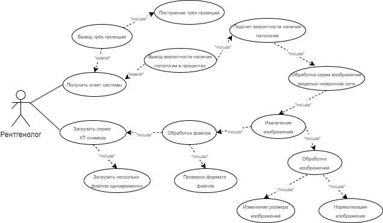

# Перечень заинтересованных лиц

В качестве заказчиков могут выступать:

1. **ГБУЗ «НПКЦ ДиТ ДЗМ» (mosmed.ai, Центр диагностики и телемедицины)**, т.к. данная организация реализует «эксперимент» по использованию инновационных технологий в области компьютерного зрения для анализа медицинских изображений и дальнейшего применения этих технологий в системе здравоохранения (подробнее). Одним из направлений является диагностика внутричерепных кровоизлияний, данные для обучения и прочая информация по теме бралась именно от этой организации;
2. **Отдел рентгенологии ГБУЗ ПК «ГКБ №3» Пермь (Пермская городская клиническая больная №3)**, т.к., врачи-рентгенологи оказывают консультационную поддержку и, возможно, обеспечат возможность тестирования готовой системы на реальных данных;

В качестве пользователя системы подразумевается врач-рентгенолог, который загружает данные для обработки и в результате получает ответ о наличии внутричерепного кровоизлияния. Данный пользователь является экспертом в области рентгенологии, соответственно, может ставить диагноз и без информационной системы. Информационная система в первую очередь используется для поддержки врачебных решений, а также, для их ускорения (врач всегда будет проверять решение информационной системы, в любом случае).

# Перечень функциональных требований

Функциональные требования:

1. **Загрузка файлов:**
   - Пользователь должен иметь возможность загружать серию КТ-снимков в DICOM формате через веб-интерфейс.
   - Система должна поддерживать загрузку нескольких файлов одновременно, т.к. подразумевается исследование именно серий снимков.

2. **Проверка формата файлов:**
   - Система должна проверять, что загруженные файлы соответствуют DICOM формату.
   - В случае загрузки файлов в неподдерживаемом формате, система должна уведомить пользователя об ошибке.

3. **Обработка изображений:**
   - Система должна извлекать изображения (массивы пикселей) из DICOM файлов и подготавливать их для обработки моделью нейронной сети.
   - Система должна строить 3 вида проекций: аксиальную, сагитальную и корональную.
   - Система должна поддерживать предобработку изображений, такую как нормализация, изменение размера и т.д. (обработанные изображения не предназначены для изучения человеком).

4. **Обработка моделью нейронной сети:**
   - Система должна использовать предобученную модель нейронной сети для анализа КТ-снимков и определения наличия внутричерепного кровоизлияния (на сервере).

5. **Вывод результатов:**
   - Система должна отображать результаты анализа на веб-странице.
   - Результаты должны включать вероятность наличия внутричерепного кровоизлияния и визуализацию трёх проекций серии КТ-снимков (аксиальную, сагитальную и корональную).

# Диаграмма вариантов использования для функциональных требований

Диаграмма вариантов использования для функциональных требований (Use Case диаграмма) изображена ниже, на рисунке 1.

# Перечень сделанных предположений

Перечень сделанных предположений по функционалу системы:

1. Необязательно использовать архитектуру нейронной сети, созданной целиком и полностью мною, можно использовать готовые архитектуры, например, из PyTorch;
2. Классификация видов внутричерепного кровоизлияния (они размечены);
3. Выдача ответа изначально подразумевалась в виде вывода вероятности наличия внутричерепного кровоизлияния на серии снимков в целом (т.к. на данных разметка без сегментации, только по классам), однако, при возможности, можно будет сделать сегментацию патологии на снимках (конкретно отмечать область, в которой найдено кровоизлияние);
4. Для улучшения качества системы возможно использование других, готовых моделей, для предварительной сегментации мозга со снимков, а также, построение проекций уже по ним;
5. Построение 3д-модели серии снимков;
6. Выдача ответа в DICOM-формате, т.к. на практике в таких системах зачастую возвращают еще и дополнительную серию снимков DICOM, с патологиями;
7. Добавление защиты в систему, т.к. все медицинские данные должны очень хорошо защищаться (врачебная тайна);
8. Развертка сайта не кажется необходимой, т.к. приложение очень узконаправленное;
9. Для встраивания в реальные системы должна быть возможность соединения с различными видами баз данных (например, ЕРИС, который используется в клиниках РФ);
10. Система должна сигнализировать о некорректной обработке изображений (такое часто бывает из-за того, что аппараты КТ делают исследования с различающимися параметрами).

# Перечень нефункциональных требований

Система должна:

1. **Обеспечивать безопасность для медицинских изображений (врачебная тайна):**
    - Изображения на сервере должны шифроваться.
    - При выдаче результата данные должны быть анонимизированы (если в DICOM-снимках была указана личная информация, ФИО, пол и прочие данные, то они удаляются).
2. **Система должна оптимизированно работать с памятью на сервере, т.к. серии КТ-снимков имеют очень большой вес (каждое исследование вполне может весить более 500 Мегабайт):**
    - Сервер должен иметь объём оперативной памяти от 32 Гигабайт (для обработки снимков);
    - Сервер должен иметь объём хранилища (жесткого диска) от 512 Гигабайт (для временного хранения снимков).
3. **Система должна быть совместима со следующими веб-браузерами:**
    - Yandex Browser;
    - Google Chrome;
    - Mozilla Firefox;
    - Microsoft Edge.
4. **Система должна быть совместима со следующими операционными системами:**
    - Windows 10;
    - Windows 11;
    - Astra Linux;
    - ALT Linux.
5. **Интерфейс системы должен поддерживать различные соотношения сторон и масштабируемость:**
    - Соотношение сторон 4:3 в разрешении 1024×768;
    - Соотношение сторон 16:9 в разрешении 1920x1080.
6. **Система должна быть устойчивой к сбоям и обеспечивать восстановление после сбоев:**
    - Система должна безотказно работать круглосуточно;
    - В случае сбоев, система должна восстанавливать работу в течение одного часа.
