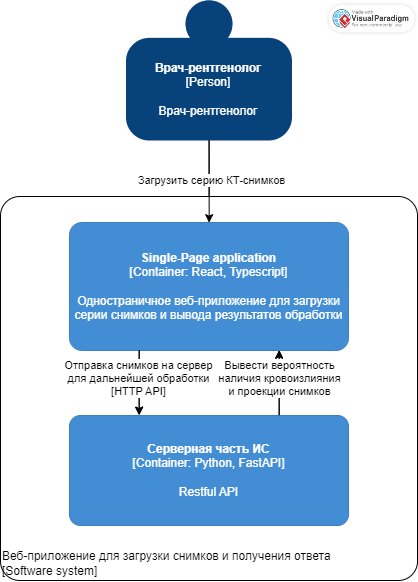

# Лабораторная работа №2. C4 Model
* Тема: Использование нотации C4 model для проектирования архитектуры программной системы 
* Цель работы: Получить опыт использования графической нотации для фиксации архитектурных решений. 
# Диаграмма системного контекста

Веб-приложение в виде SPA с возможность загрузить снимки и получить ответ после обработки снимков сервером.

# Диаграмма контейнеров

Для данной системы выбран архитектурный стиль микросервисов. Этот стиль подразумевает разделение системы на независимые модули (микросервисы), которые могут разрабатываться, развертываться и масштабироваться независимо друг от друга, что позволяет улучшить гибкость, масштабируемость и отказоустойчивость системы.

SPA веб-приложение на библиотеке React служит для загрузки снимков и отправки их на сервер.

Дальнейшая обработка загруженной серии КТ-снимков происходит на сервере.

Помимо вероятности наличия кровоизлияния, пользователю дополнительно выводятся построенные проекции (аксиальная, корональная и сагитальная).

# Диаграмма компонентов

Для идентификации кровоизлияния серию загруженных снимков сначала необходимо обработать, для чего выделен отдельный компонент предобработки КТ-снимков (извлечение изображений из DICOM-файлов, изменение их размера, выделение тканей, нормализация).

После предобработки снимков, исследование обрабатывается моделью нейронной сети, с целью идентификации внутричерепного кровоизлияния.