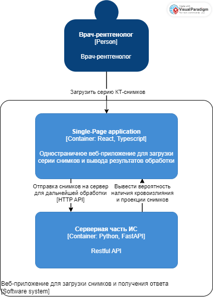
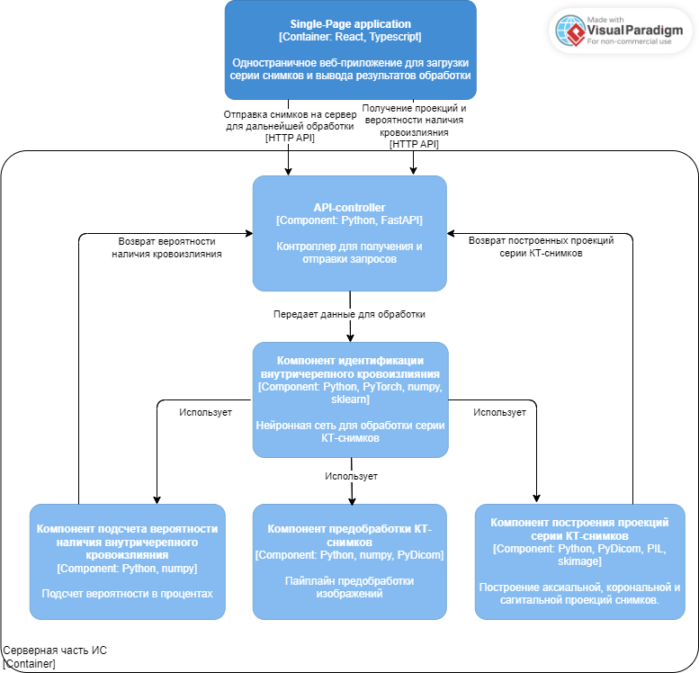
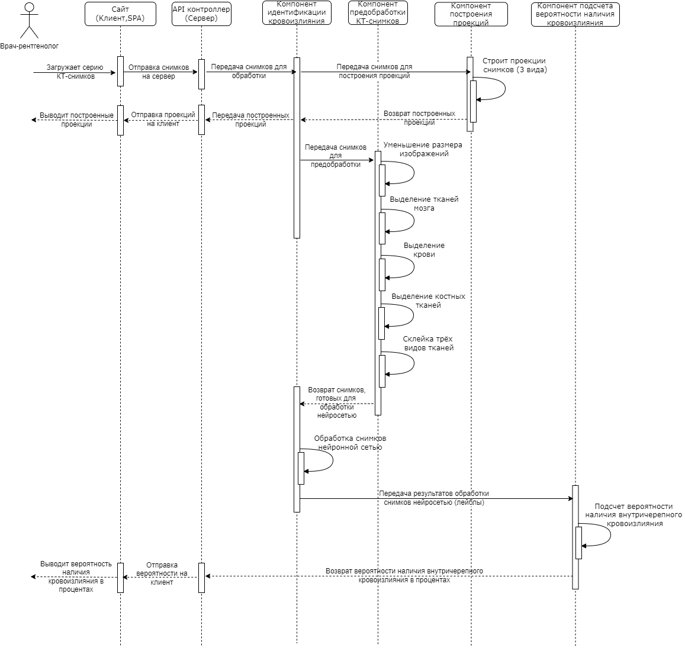
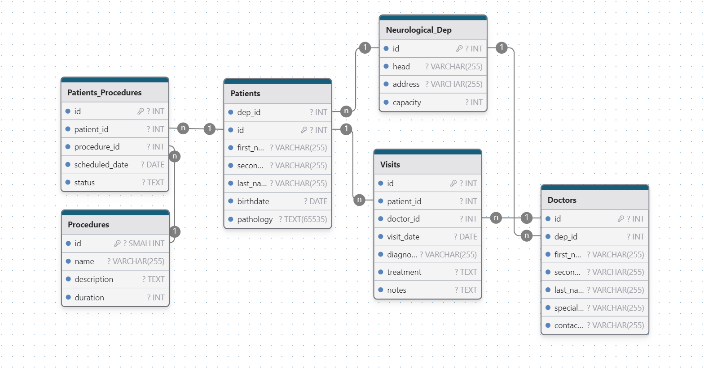

# Лабораторная работа №3.
* **Тема:** Использование принципов проектирования на уровне методов и классов
* **Цель работы:** Получить опыт проектирования и реализации модулей с использованием принципов KISS, YAGNI, DRY, SOLID и др.

# Диаграмма контейнеров


# Диаграмма компонентов


# Диаграмма последовательностей

**Рассматриваемый вариант использования системы:**
Врач-рентгенолог при помощи сайта загружает серию КТ-снимков (исследование) для обработки, с целью идентификации внутричерепного кровоизлияния. Исследование отправляется на сервер, где обрабатывается моделью нейронной сети. Результат обработки представляет собой вероятность наличия внутричреепного кровоизлияния, в процентах.



# Модель БД (не предусмотрена)
**К данной работе база данных не предусмотрена, поэтому, была построена модель БД для *"Неврологического отделения больницы"***



# Применение основных принципов разработки

**KISS (Keep it stupid simple)** - Функции реализованы максимально простыми и понятными. Каждая функция выполняет одно, понятное, небольшое, законченное действие.

Для упрощения работы со шкалой Хаунсфилда и прочей предобработкой данных, были добавлены константы.

```
IMAGE_SIZE = (150, 150)
BRAIN_HU = (22, 50)
BONES_HU = (220, 2000)
BLOOD_HU = (50, 75)
BASE = r"M:\Diplom"
```

Также, в целом код на Python является максимально простым.

Функция для вывода гистограммы шкалы Хаунсфилда серии снимков:

```
def plot_hu(images):
    plt.hist(images.flatten(), bins=80, color='c')
    plt.xlabel("Hounsfield Units (HU)")
    plt.ylabel("Frequency")
    plt.show()
```
Функция для изменения размера трёхмерного массива пикселей:
```
def resize_array(array):
    zoom_factors = (128 / array.shape[0], 1, 1)
    resized_array = scipy.ndimage.zoom(array, zoom_factors, order=1)
    return resized_array
```

**YAGNI (You ain't gonna need it)** - Никакой лишний функционал не реализовывается. Сначала нужно доработать текущую итерацию проекта.
Также, каждая функция отвечает только за своё действие.

**DRY (Don't repeat yourself)** - максимальное избегание повторений. Все повторяющиеся действия были вынесены в отдельные функции, что обеспечивает простоту кода (и уменьшает его объем).

Например, при построении проекций разных видов тканей (ткани мозга, костные ткани, кровь), используются функции для выделения соответствующих тканей, с указанием разных границ по шкале Хаунсфилда, а затем здесь же происходит изменение размеров этих изображений, что значительно упрощает и уменьшает код:
```
def get_stacked_structures_from_dicom(dicom_list):
    patient_pixels = resize_dicom_list(dicom_list)

    brain = resize_array(get_structures_only(patient_pixels, BRAIN_HU))
    bones = resize_array(get_structures_only(patient_pixels, BONES_HU))
    blood = resize_array(get_structures_only(patient_pixels, BLOOD_HU))

    stacked_image = np.stack((brain, bones, blood), axis=0)

    return stacked_image

```

### **SOLID**
**SRP (Принцип единственной ответственности)** - Классы и функции имеют одну ответственность. Функции могут изменяться независимо друг от друга. Например, если потребуется изменить принцип выделения тканей, то изменяется только функция segment_hu_mask(), а остальные функции, использующие её (например, get_structures_only), не изменяются.

Также, при изменении значений в константах (если, например, надо будет изменить размер всех изображений), функции спокойно под них подстроятся, внутри функций менять ничего не придется.
```
def segment_hu_mask(image, hu_threshold, fill_bone_structures=True):
    binary_image = np.logical_not(np.logical_and(image > hu_threshold[0], image < hu_threshold[1])).astype(np.int8) + 1
    labels = measure.label(binary_image)
    background_label = labels[0, 0, 0]
    binary_image[background_label == labels] = 2

    if fill_bone_structures:
        fill_structures(binary_image)

    binary_image -= 1
    binary_image = 1 - binary_image

    for i, axial_slice in enumerate(binary_image):
        labels = measure.label(axial_slice, background=0)
        l_max = hu_good_pixels(labels, bg=0)
        if l_max is not None:
            binary_image[i][labels != l_max] = 0

    return binary_image
```
**ORP (принцип открытости/закрытости)** - Классы и функции, например, класс модели, могут спокойной быть расширены без изменения их существующего кода.

Например, модель спокойной может быть расширена дополнительными слоями (предположим, понадобилось добавить несколько полносвязных выходных слоев нейронов перед выдачей результата обработки):
```
class MedicalNet(nn.Module):
    def __init__(self):
        super(MedicalNet, self).__init__()
        self.model = models.video.r3d_18(models.video.R3D_18_Weights.KINETICS400_V1)
        # Изменение количества входных каналов в первом сверточном слое
        self.model.stem[0] = nn.Conv3d(3, 64, kernel_size=(3, 7, 7), stride=(1, 2, 2), padding=(1, 3, 3), bias=False)
        self.model.fc = nn.Linear(self.model.fc.in_features, 1)

    def forward(self, x):
        return self.model(x)
```
**LSP (Принцип подстановки Барбары Лисков)** - для создания своих классов модели и датасетов используются базовые классы из библиотеки torchvision, после чего они без проблем используются при обучении модели.

Код класса модели нейронной сети (базовый класс - Module из torch.nn): 
```
class MedicalNet(nn.Module):
    def __init__(self):
        super(MedicalNet, self).__init__()
        self.model = models.video.r3d_18(models.video.R3D_18_Weights.KINETICS400_V1)
        # Изменение количества входных каналов в первом сверточном слое
        self.model.stem[0] = nn.Conv3d(3, 64, kernel_size=(3, 7, 7), stride=(1, 2, 2), padding=(1, 3, 3), bias=False)
        self.model.fc = nn.Linear(self.model.fc.in_features, 1)

    def forward(self, x):
        return self.model(x)
```

Код класса датасета (базовый класс - Dataset из torch.utils.data):
```
class MedicalDataset(Dataset):
    def __init__(self, data, labels):
        self.data = data
        self.labels = labels

    def __len__(self):
        return len(self.data)

    def __getitem__(self, idx):
        series = self.data[idx]
        label = self.labels[idx]
        series = torch.tensor(series, dtype=torch.float16)
        label = torch.tensor(label, dtype=torch.long)
        return series, label
```

**ISP (Принцип разделения интерфейсов)** - классы, указанные выше, никак не зависят от функций, которые они не используют. Неважно, как меняются данные, которые будет получать модель, её код (и код датасета) менять не придется.

**DIP (Принцип инверсии зависимости)** - функции зависят в первую очередь от абстракции, а не от конкретики. Никакие функции с конкретной реализацией не переопределяются.

Этому, также, способствует использование констант. Например, неважно, как будет меняться принцип выделения тканей, их границы по шкале Хаунсфилда всё равно будут использоваться в тех же местах.
(Функции уже были указаны выше)

# Дополнительные принципы разработки

#### BDUF (Big design up front - Масштабное проектирование прежде всего)
Это подход к разработке программного обеспечения, при котором значительное время и усилия уделяются детальному проектированию системы до начала её реализации. Это включает в себя создание подробных спецификаций, архитектурных схем, диаграмм и других документов.
**Плюсы:**
- Подходит для крупных и сложных проектов, где ошибки в архитектуре могут быть критичными.
- Снижает риск непредвиденных проблем на этапе реализации.
- Облегчает координацию между большими командами. (Я один в команде)

**Минусы:**
- Может быть избыточным для небольших проектов или проектов с быстро меняющимися требованиями.
- Требует значительных временных и ресурсных затрат на этапе проектирования.
- Может привести к задержкам в начале проекта.

**Вердикт:** отказ, т.к. в моем проекте вполне могут быть быстроменяющиеся требования, т.к. самым основным является именно разработка модели нейронной сети, а приложение (веб-приложение), фактически, уходит на второй план. Также, по мере разработки модели нейросети, может меняться и функционал системы. Например, если повезет, и удастся добавить сегментацию патологии на снимках, то тогда явно придется сильно переделывать интерфейс веб-приложения, а также, метрики для тестирования модели. Поэтому, BDUF кажется избыточным и неэффективным.

####  SoC (Separation of Concerns - Принцип разделения ответственности)
Это принцип, при котором система разбивается на отдельные компоненты, каждый из которых отвечает за свою конкретную задачу или аспект функциональности. Это помогает уменьшить сложность и улучшить управляемость системы.
**Плюсы:**
- Упрощает разработку, тестирование и поддержку системы.
- Облегчает параллельную работу членов команды над разными компонентами. (хоть я и один в команде)
- Улучшает модульность и повторное использование кода.

**Минусы:**
- Может увеличить сложность интеграции компонентов.
- Требует тщательного планирования и проектирования.

**Вердикт:** в целом принцип применим, т.к. с ним система становится куда более управляемой и масштабируемой. Легче будет дополнять систему, если появится такая возможность.

#### MVP (Minimum Viable Product - Минимально жизнеспособный продукт)
Это подход к разработке, при котором создается минимально жизнеспособный продукт с базовыми функциями, достаточными для удовлетворения первых пользователей и получения обратной связи.
**Плюсы:**
- Позволяет быстро получить обратную связь (результаты тестирования).
- Снижает риск и затраты на разработку.
- Обеспечивает фокусировку на самом важном функционале.
- Упрощает проектирование системы.
**Минусы:**
- Может иметь сильно ограниченный функционал.
- Может требовать постоянного улучшения и добавления новых функций.

**Вердикт:** применим и будет использоваться, т.к. в моей системе важно реализовать базовый функционал (простая бинарная классификация), её уже будет достаточно для того, чтобы система работала и проект в целом был завершен. Это очень важно еще и потому, что неизвестно, получится ли вообще улучшить систему (добавить мультикласовую классификацию, или вообще, сегментацию, т.к. это напрямую зависит от данных для обучения).

#### PoC (Proof of Concept - доказательство концепции)
это подход к разработке, при котором создается прототип или демонстрация концепции для проверки её жизнеспособности и технической реализуемости.
**Плюсы:**
- Позволяет проверить техническую реализуемость идеи перед полномасштабной разработкой.
- Снижает риск и затраты на разработку.
- Облегчает связь с заказчиком.
**Минусы:**
- Может быть недостаточно функциональным для реального использования.
- Требует дополнительных усилий для перехода от PoC к полноценному продукту.

**Вердикт:** можно сказать, что уже используется, т.к. при изначальной обработке данных и обучении моделии очень важны различного рода эксперименты, например, с разынми видами предобработки данных, разными архитектурами моделей и т.д.. Очень важно проверять почти все возможные способы, для реализации лучшей системы. Бесполезно было бы полностью разработать весь проект без доказательств того, что моя модель в целом работает.