# Лабораторная работа №4.
* **Тема:** Проектирование REST API

* **Цель работы:** Получить опыт проектирования программного интерфейса.

**В качестве платформы был выбран фреймворк FastAPI (Python)**

**Реализацию API смотреть в ./src/**

PUT, POST тоже сделал и протестировал.

## Принятые проектные решения при проектировании API

**1. Входные данные:**
- Входные данные в формате DICOM-файлов (.dcm, формат медицинских изображений).
- Будут загружаться сразу серии снимков, то есть, по 200-500 файлов. Загружаться будут через multipart/form-data,

**2. Входные данные:**
- Выходные данные в формате JSON с результатами анализа и изображения проекций (в формате base64).

**3. Обработка ошибок**
- Возврат HTTP-кодов ошибок (400, 404 и 500, например), с описанием ошибок в JSON.
Например:
    **При 400 Bad Request:**
    ```
    {
    "error": "Bad Request",
    "message": "Invalid file format. Expected DICOM."
    }
    ```

    **При 404 Not Found:**
    ```
    {
    "error": "Not Found",
    "message": "Study with ID '12345' not found."
    }
    ```

    **500 Internal Server Error::**
    ```
    {
    "error": "Internal Server Error",
    "message": "An unexpected error occurred. Please try again later."
    }
    ```


**4. Документация для API**
- Использовать Swagger или ReDoc для автоматической генерации документации в дальнейшем.

**5. Ограничение на количество загружаемых данных**
- Т.к. необходимо защитить сервер от неправильной загрузки данных, то стоить ограничить количество загружаемых файлов (пусть, до 1000 снимков, т.к. при работе с КТ головного мозга, столько снимков явно быть не должно)

**6. Ограничение на объем загружаемых данных**
- Ограничить размер загружаемых файлов (до 1 Гигабайта)

**7. Улучшение производительности и масштабируемости**
- Использовать асинхронные запросы для обработки снимков.

# **8. Методы API**
1. ### `POST /upload<` — загрузка DICOM-файлов.

    **Параметры:**
    `files`: DICOM-файлы (128 штук, multipart/form-data).

    **Ответ:**
    ```json
    {
    "id": "12345",
    "status": "processing"
    }
    ```

    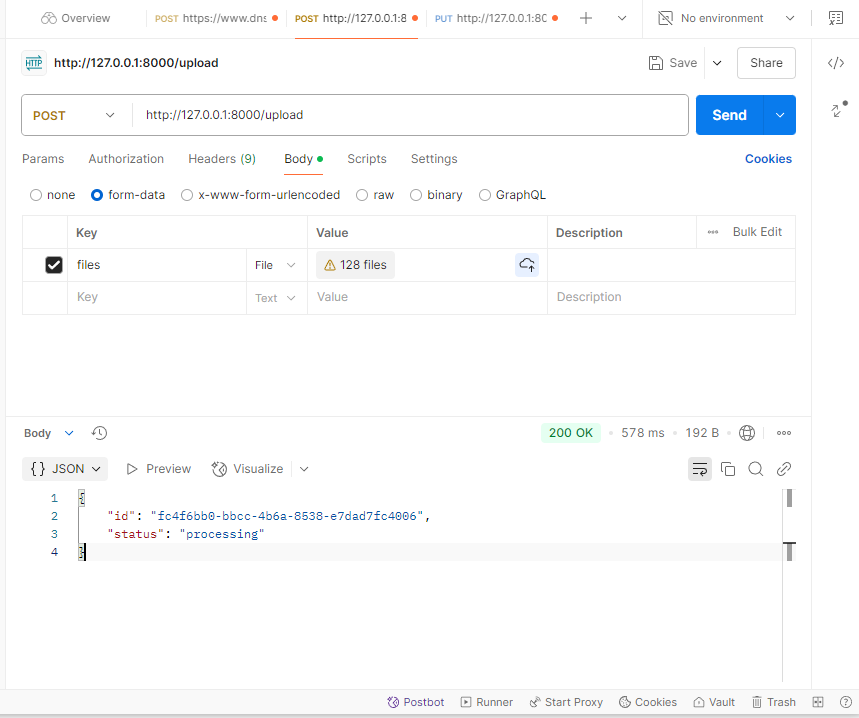

    **Параметры:**
    'files' : 

    **Ответ:**
    ```json
    {
    "error": "Bad Request",
    "message": {
        "error": "Bad Request",
        "message": "Invalid file format. Expected DICOM."
    }
    }
    ```

    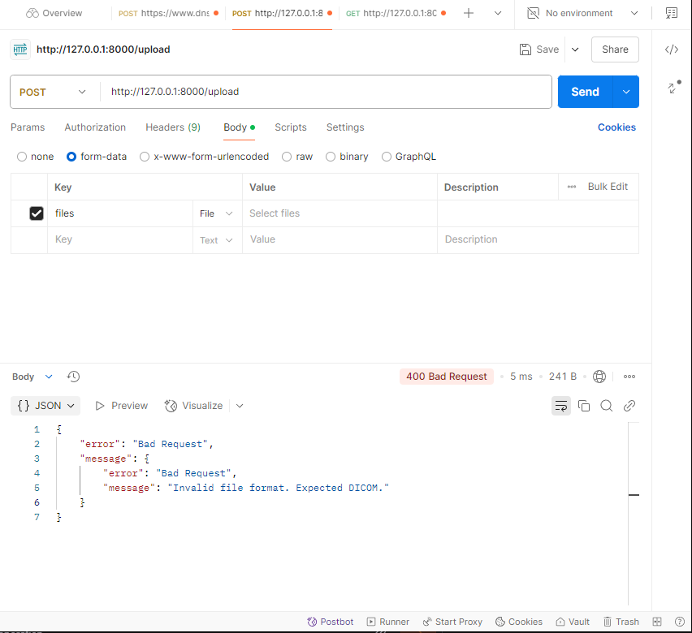

2. ### `GET /results/{id}` — получение результатов анализа по ID исследования.

    **Параметры:**
    id: ID исследования. (fc4f6bb0-bbcc-4b6a-8538-e7dad7fc4006, существующее исследование)

    **Ответ:**
    ```json
    {
    "id": "fc4f6bb0-bbcc-4b6a-8538-e7dad7fc4006",
    "status": "completed",
    "hemorrhage_probability": -9.059296607971191
    }
    ```

    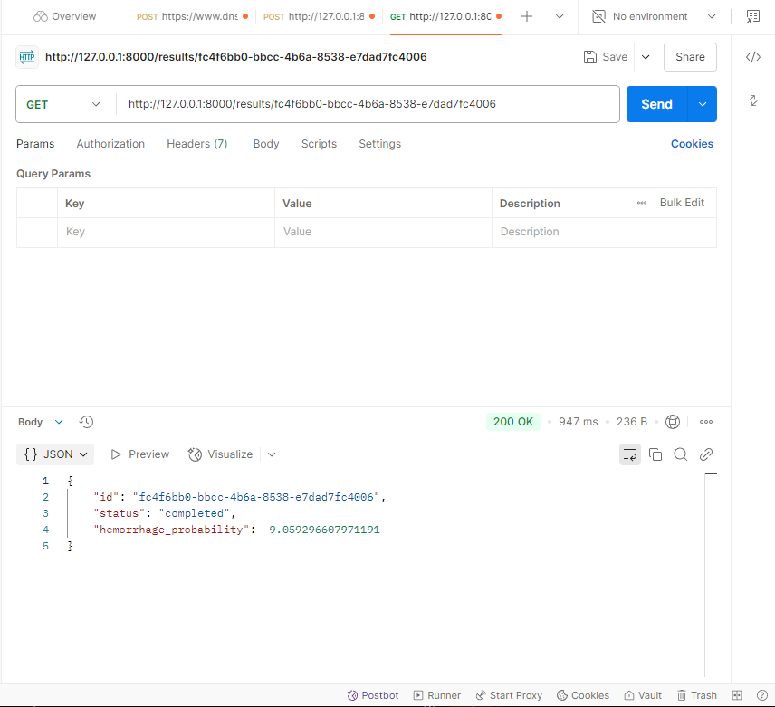

    **Параметры:**
    id: несуществующий ID исследования. (doesntexist, несуществующее исследование)

    **Ответ:**
    ```json
    {
    "error": "Not Found",
    "message": "Study with ID 'doesntexsist' not found."
    }
    ```

    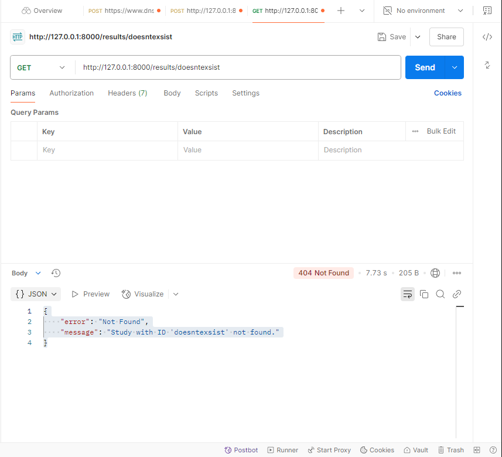


3. ### `GET /projections/{id}` — получение проекций (аксиальная, корональная, сагитальная) по ID исследования.

    **Параметры:**
    id: ID исследования. (fc4f6bb0-bbcc-4b6a-8538-e7dad7fc4006, существующее исследование)

    **Ответ:**
    ```json
    {
    "axial": "base64-encoded-image",
    "coronal": "base64-encoded-image",
    "sagittal": "base64-encoded-image"
    }
    ```

    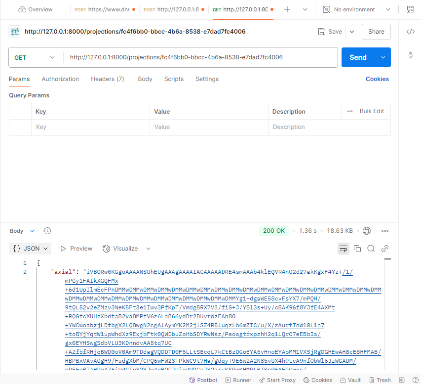

    **Параметры:**
    id: несуществующий ID исследования. (doesntexist, несуществующее исследование)

    **Ответ:**
    ```json
    {
        "error": "Not Found",
        "message": "Study with ID 'doesntexist' not found."
    }
    ```

    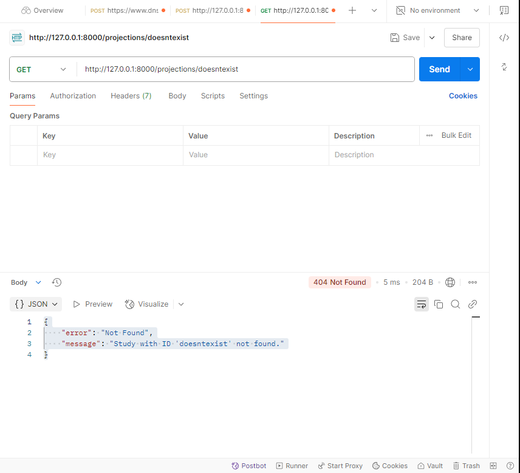

4. ### `GET /attention-maps/{id}` — получение карт внимания (если они нужны).

    **Параметры:**
    id: ID исследования. (fc4f6bb0-bbcc-4b6a-8538-e7dad7fc4006, существующее исследование)

    **Ответ:**
    ```json
    {
    "attention_map": "base64-encoded-image",
    }
    ```

    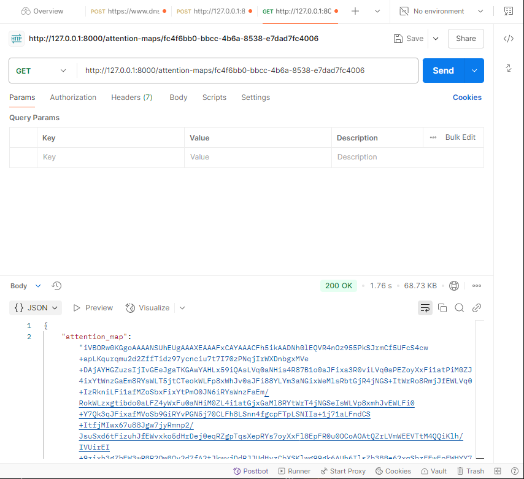

    **Параметры:**
    id: несуществующий ID исследования. (doesntexist, несуществующее исследование)

    **Ответ:**
    ```json
    {
        "error": "Not Found",
        "message": "Study with ID 'doesntexist' not found."
    }
    ```

    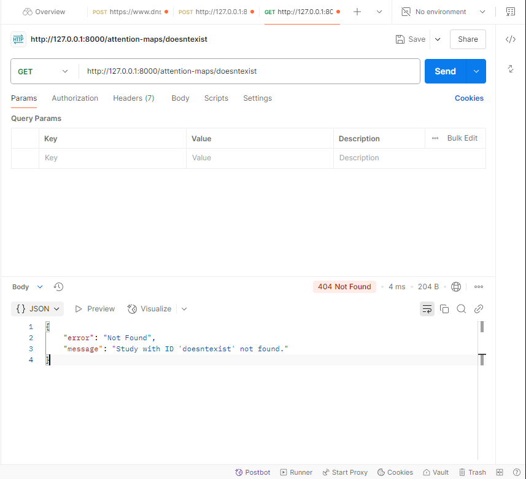

5. ### `DELETE /results/{id}` — удаление исследования по ID.

    **Параметры:**
    id: ID исследования. (ab18d6a0-0533-496e-9de6-eb26756ff671, существующее исследование)

    **Ответ:**
    ```json
    {
    "status": "deleted"
    }
    ```

    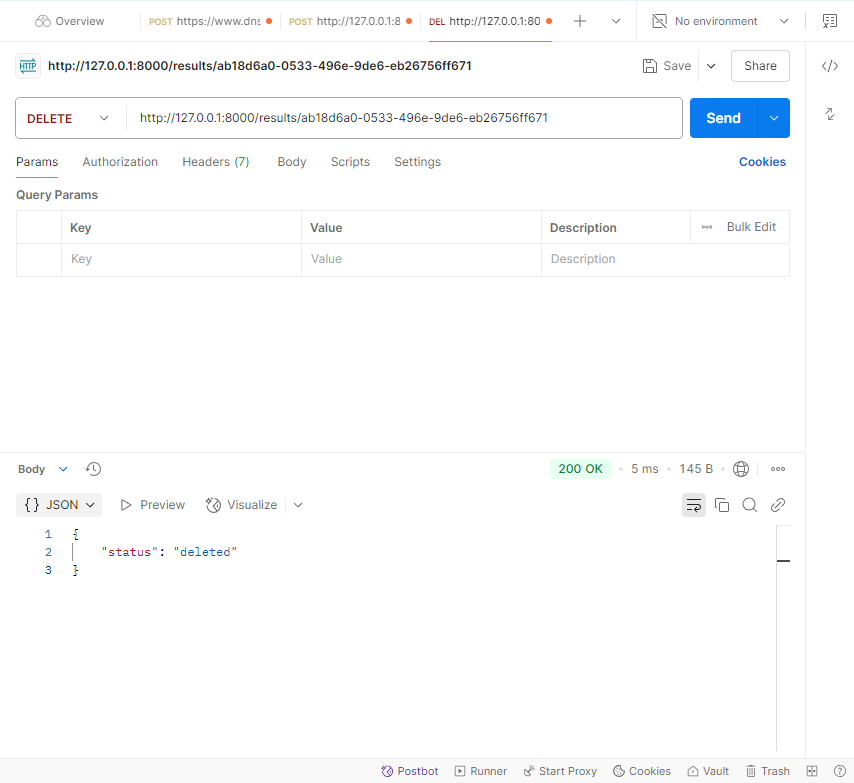

    **Параметры:**
    id: несуществующий ID исследования. (doesntexist, несуществующее исследование)

    **Ответ:**
    ```json
    {
        "error": "Not Found",
        "message": "Study with ID 'doesntexist' not found."
    }
    ```

    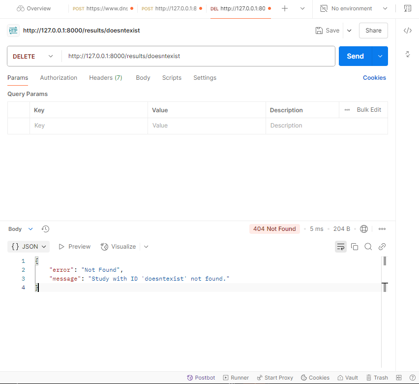

6. ### `PUT /results/{id}` — обновление метаданных исследования (например, добавление комментария врача).

    **Параметры:**
    id: ID исследования. (fc4f6bb0-bbcc-4b6a-8538-e7dad7fc4006, существующее исследование)
    comment: Test comment!

    **Ответ:**
    ```json
    {
        "id": "fc4f6bb0-bbcc-4b6a-8538-e7dad7fc4006",
        "comment": "Test comment!"
    }
    ```

    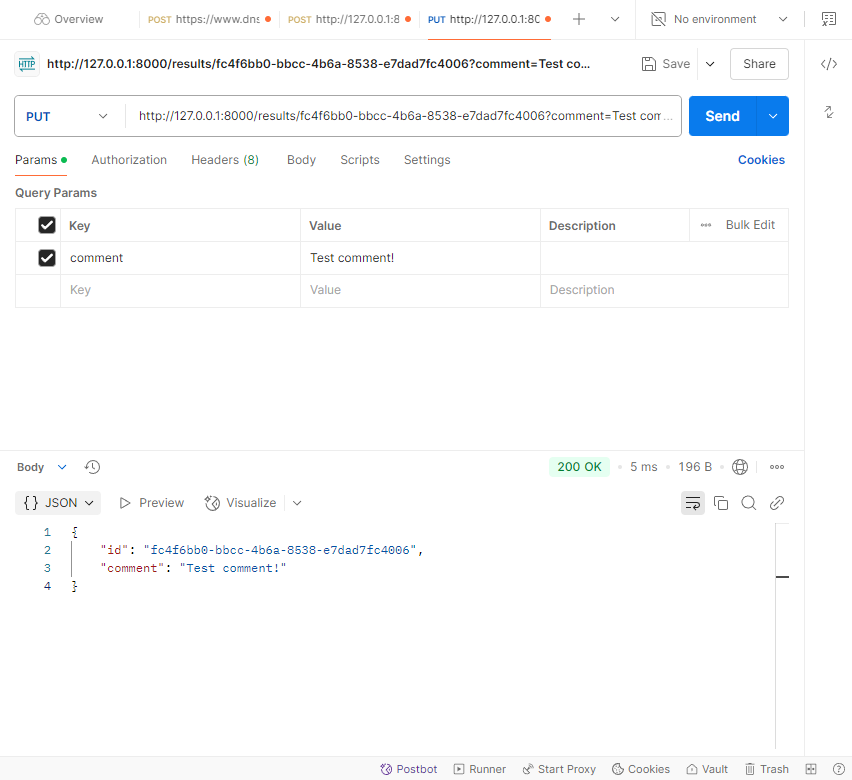

    **Параметры:**
    id: несуществующий ID исследования. (doesntexist, несуществующее исследование)
    comment: Test comment!

    **Ответ:**
    ```json
    {
        "error": "Not Found",
        "message": "Study with ID 'doesntexist' not found."
    }
    ```

    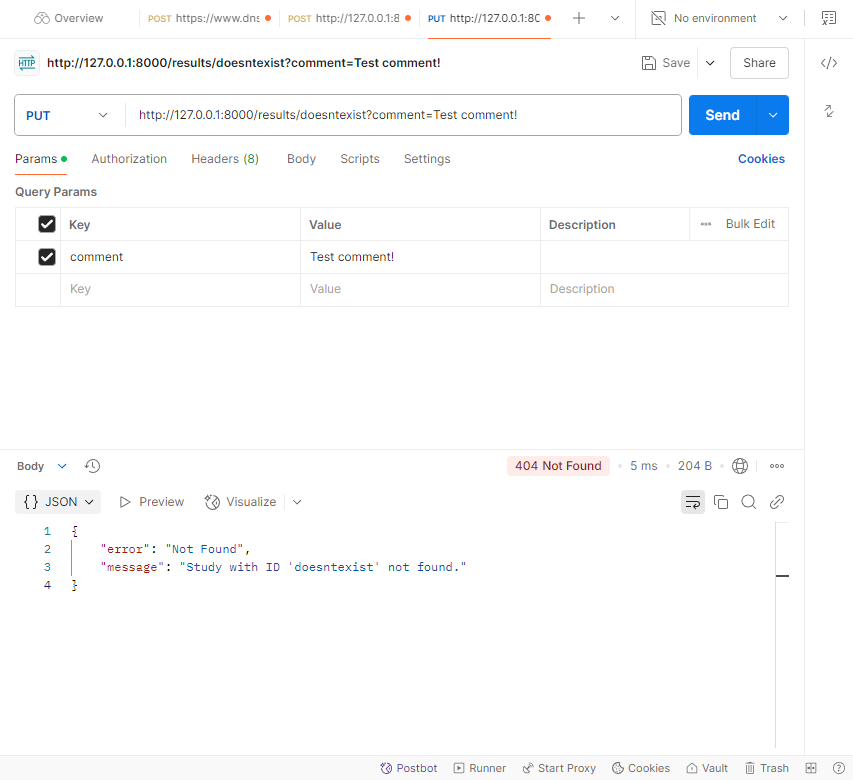

