# Лабораторная работа №6.
**Тема:** Использование шаблонов проектирования

**Цель работы:** Получить опыт применения шаблонов проектирования при написании кода программной системы.

# Шаблоны проектирования GoF

## Порождающие шаблоны

#### Singleton
**Назначение**: Гарантирует, что класс имеет только один экземпляр, и предоставляет глобальную точку доступа к этому экземпляру.

**UML-диаграмма**:
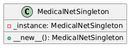
**Код:**
```
class MedicalNetSingleton:
    _instance = None

    def __new__(cls, *args, **kwargs):
        if cls._instance is None:
            cls._instance = super(MedicalNetSingleton, cls).__new__(cls)
            cls._instance.model = models.video.r3d_18(models.video.R3D_18_Weights.KINETICS400_V1)
            cls._instance.model.stem[0] = nn.Conv3d(3, 64, kernel_size=(3, 7, 7), stride=(1, 2, 2), padding=(1, 3, 3), bias=False)
            cls._instance.model.fc = nn.Linear(cls._instance.model.fc.in_features, 1)
        return cls._instance
```

#### Factory Method
**Назначение:** Определяет интерфейс для создания объекта, но оставляет подклассам решение о том, какой класс инстанцировать.

**UML-диаграмма:**
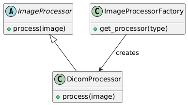
**Код:**
```
class ImageProcessor:
    def process(self, image):
        pass

class DicomProcessor(ImageProcessor):
    def process(self, image):
        return resize_and_voi_lut(image)

class ImageProcessorFactory:
    def get_processor(self, type):
        if type == "dicom":
            return DicomProcessor()
        else:
            raise ValueError("Unknown processor type")
```

#### Builder

**Назначение:** Отделяет конструирование сложного объекта от его представления.

**UML-диаграмма:**
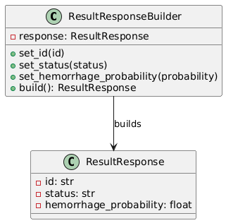
**Код:**
```
class ResultResponseBuilder:
    def __init__(self):
        self.response = ResultResponse(id="", status="", hemorrhage_probability=0.0)

    def set_id(self, id):
        self.response.id = id
        return self

    def set_status(self, status):
        self.response.status = status
        return self

    def set_hemorrhage_probability(self, probability):
        self.response.hemorrhage_probability = probability
        return self

    def build(self):
        return self.response
```

## Структурные шаблоны
#### Adapter
**Назначение:** Преобразует интерфейс класса в другой интерфейс, ожидаемый клиентом.

**UML-диаграмма:**
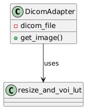
**Код:**
```
class DicomAdapter:
    def __init__(self, dicom_file):
        self.dicom_file = dicom_file

    def get_image(self):
        return resize_and_voi_lut(self.dicom_file)
```

#### Composite
**Назначение:** Компонует объекты в древовидные структуры для представления иерархий.

**UML-диаграмма:**
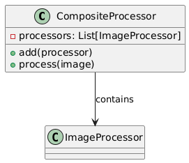

**Код:**
```
class CompositeProcessor(ImageProcessor):
    def __init__(self):
        self.processors = []

    def add(self, processor):
        self.processors.append(processor)

    def process(self, image):
        for processor in self.processors:
            image = processor.process(image)
        return image
```

#### Decorator
**Назначение:** Динамически добавляет объекту новые обязанности.

**UML-диаграмма:**
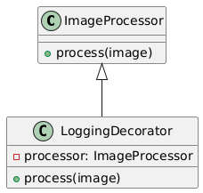
**Код:**
```
class LoggingDecorator(ImageProcessor):
    def __init__(self, processor):
        self.processor = processor

    def process(self, image):
        print("Processing image")
        result = self.processor.process(image)
        print("Image processed")
        return result
```

#### Facade
**Назначение:** Предоставляет унифицированный интерфейс к набору интерфейсов в подсистеме.

**UML-диаграмма:**
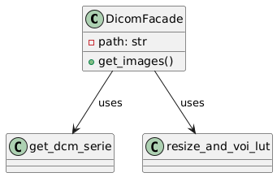
**Код:**
```
class DicomFacade:
    def __init__(self, path):
        self.path = path

    def get_images(self):
        series = get_dcm_serie(self.path)
        return [resize_and_voi_lut(dicom) for dicom in series]
```

## Поведенческие шаблоны
#### Observer
**Назначение:** Определяет зависимость "один ко многим" между объектами, чтобы при изменении состояния одного объекта все зависящие от него объекты уведомлялись и обновлялись автоматически.

**UML-диаграмма:**
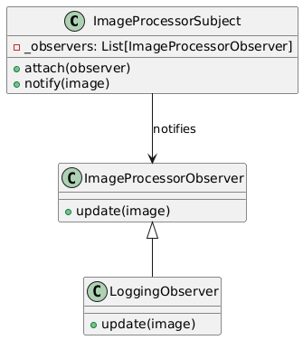
**Код:**
```
class ImageProcessorSubject:
    def __init__(self):
        self._observers = []

    def attach(self, observer):
        self._observers.append(observer)

    def notify(self, image):
        for observer in self._observers:
            observer.update(image)

class ImageProcessorObserver:
    def update(self, image):
        pass

class LoggingObserver(ImageProcessorObserver):
    def update(self, image):
        print(f"Image processed: {image}")
```

#### Strategy
**Назначение:** Определяет семейство алгоритмов, инкапсулирует каждый из них и делает их взаимозаменяемыми.

**UML-диаграмма:**
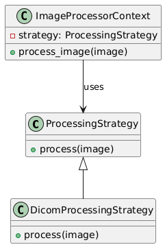
**Код:**
```
class ProcessingStrategy:
    def process(self, image):
        pass

class DicomProcessingStrategy(ProcessingStrategy):
    def process(self, image):
        return resize_and_voi_lut(image)

class ImageProcessorContext:
    def __init__(self, strategy):
        self.strategy = strategy

    def process_image(self, image):
        return self.strategy.process(image)
```

#### Command
**Назначение:** Инкапсулирует запрос как объект, позволяя параметризовать клиенты с различными запросами, организовывать очередь запросов и поддерживать отмену операций.

**UML-диаграмма:**
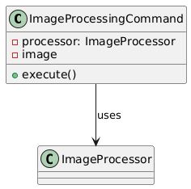
**Код:**
```
class ImageProcessingCommand:
    def __init__(self, processor, image):
        self.processor = processor
        self.image = image

    def execute(self):
        return self.processor.process(self.image)
```

#### Chain of Responsibility
**Назначение:** Позволяет передавать запросы последовательно по цепочке обработчиков.

**UML-диаграмма:**
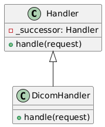
**Код:**
```
class Handler:
    def __init__(self, successor=None):
        self._successor = successor

    def handle(self, request):
        if self._successor:
            return self._successor.handle(request)
        return None

class DicomHandler(Handler):
    def handle(self, request):
        if request.endswith(".dcm"):
            return resize_and_voi_lut(request)
        else:
            return super().handle(request)
```

#### State
**Назначение:** Позволяет объекту изменять свое поведение при изменении его внутреннего состояния.

**UML-диаграмма:**
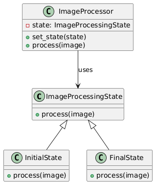
**Код:**
```
class ImageProcessingState:
    def process(self, image):
        pass

class InitialState(ImageProcessingState):
    def process(self, image):
        print("Initial processing")
        return image

class FinalState(ImageProcessingState):
    def process(self, image):
        print("Final processing")
        return image

class ImageProcessor:
    def __init__(self):
        self.state = InitialState()

    def set_state(self, state):
        self.state = state

    def process(self, image):
        return self.state.process(image)
```
